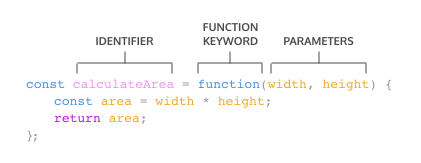

Link to lesson:

https://www.codecademy.com/paths/build-web-apps-with-react/tracks/bwa-javascript-functions-arrays-and-loops/modules/learn-javascript-functions/lessons/functions/exercises/function-expressions

### FUNCTIONS

**Function Expressions**

Another way to define a function is to use a function expression. To define a function inside an expression, we can use the function keyword. In a function expression, the function name is usually omitted. A function with no name is called an anonymous function. A function expression is often stored in a variable in order to refer to it.

Consider the following function expression:



To declare a function expression:

Declare a variable to make the variable’s name be the name, or identifier, of your function. Since the release of ES6, it is common practice to use const as the keyword to declare the variable.

Assign as that variable’s value an anonymous function created by using the function keyword followed by a set of parentheses with possible parameters. Then a set of curly braces that contain the function body.

To invoke a function expression, write the name of the variable in which the function is stored followed by parentheses enclosing any arguments being passed into the function.
```
variableName(argument1, argument2)
```

Unlike function declarations, function expressions are not hoisted so they cannot be called before they are defined.

Let’s define a new function using a function expression.

### Instructions
Checkpoint 1 Passed
1. Let’s say we have a plant that we need to water once a week on Wednesdays. We could define a function expression to help us check the day of the week and if the plant needs to be watered:

- Create a variable named plantNeedsWater using the const variable keyword.
- Assign an anonymous function that takes in a parameter of day to plantNeedsWater.

Hint

To write a function expression, use the following syntax:
```
const variableName = function(paramGoesHere){
};

```
2. Now we need to add some code to the function body of plantNeedsWater():

In the function body add an if conditional that checks day === 'Wednesday'.
If the conditional is truthy, inside the if code block, use the return keyword to return true.
We’re adding an if conditional inside the function body of plantNeedsWater() to check if day === 'Wednesday':
```
const plantNeedsWater = function(day){
  if(day === 'Wednesday'){
  }
};

```
Then, inside the if conditional code block, return true.
```
const plantNeedsWater = function(day){
  if(day === 'Wednesday'){
    return true;
  }
};
```

3. On days that aren’t 'Wednesday', plantNeedsWater() should return false:

- Add an else statement after the if statement.
- Inside the else statement use the return keyword to return false.

Hint

First add an else statement after the if statement:
```
const plantNeedsWater = function(day){
  if(day === 'Wednesday'){
    return true;
  } else {
  }
};

```

Then inside the else statement, return `false.
```
const plantNeedsWater = function(day){
  if(day === 'Wednesday'){
    return true;
  } else {
    return false;
  }
};

```

4. Call the plantNeedsWater() and pass in 'Tuesday' as an argument.

Hint

To call a function, add a set of parentheses to the name of the function and pass in the necessary arguments:
```
const someFunction = function(foo) {
  return foo;
};

// To call the function: 
someFunction('an argument');

```

5. Let’s check that plantNeedsWater() returned the expected value.

Log plantNeedsWater('Tuesday') to the console. If it worked correctly, you should see false logged to the console.

Hint

To log the value of plantNeedsWater('Tuesday') to the console we can use the following syntax:
```
console.log(plantNeedsWater('Tuesday')); // Output: false

```
You can also save the value of plantNeedsWater('Tuesday') to a variable and log the variable like so:
```
const waterCheck = plantNeedsWater('Tuesday');
console.log(waterCheck); // Output: false
```
