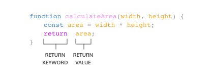

lesson link:

https://www.codecademy.com/paths/build-web-apps-with-react/tracks/bwa-javascript-functions-arrays-and-loops/modules/learn-javascript-functions/lessons/functions/exercises/return


### FUNCTIONS

**Return**

When a function is called, the computer will run through the function’s code and evaluate the result. By default, the resulting value is undefined.
```
function rectangleArea(width, height) {
  let area = width * height;
}
console.log(rectangleArea(5, 7)) // Prints undefined
```
In the code example, we defined our function to calculate the area of a width and height parameter. Then rectangleArea() is invoked with the arguments 5 and 7. But when we went to print the results we got undefined. Did we write our function wrong? No! In fact, the function worked fine, and the computer did calculate the area as 35, but we didn’t capture it. So how can we do that? With the keyword return!



To pass back information from the function call, we use a return statement. To create a return statement, we use the return keyword followed by the value that we wish to return. Like we saw above, if the value is omitted, undefined is returned instead.

When a return statement is used in a function body, the execution of the function is stopped and the code that follows it will not be executed. Look at the example below:

```
function rectangleArea(width, height) {
  if (width < 0 || height < 0) {
    return 'You need positive integers to calculate area!';
  }
  return width * height;
}

```
If an argument for width or height is less than 0, then rectangleArea() will return 'You need positive integers to calculate area!'. The second return statement width * height will not run.

The return keyword is powerful because it allows functions to produce an output. We can then save the output to a variable for later use.

### Instructions
Checkpoint 1 Passed
1. Imagine if we needed to order monitors for everyone in an office and this office is conveniently arranged in a grid shape. We could use a function to help us calculate the number of monitors needed!

Declare a function monitorCount() that has two parameters. The first parameter is rows and the second parameter is columns.

To write a function, use the following syntax:

function functionName(firstParameter, secondParameter){
};

Checkpoint 2 Passed
2. Let’s compute the number of monitors by multiplying rows and columns and then returning the value.

In the function body of the function you just wrote, use the return keyword to return rows * columns.

To return a value in a function expression, use the return keyword. Take a look at the following syntax:

function functionName(parameterName){
  return parameterName;
};

Checkpoint 3 Passed
3. Now that the function is defined, we can compute the number of monitors needed. Let’s say that the office has 5 rows and 4 columns.

Declare a variable named numOfMonitors using the const keyword and assign numOfMonitors the value of invoking monitorCount() with the arguments 5 and 4.

Since you want to save a value, declare a variable named numOfMonitors using the const keyword. We assign its value using the = operator and calling monitorCount(5, 4). monitorCount(5, 4) will get evaluated to 20. So the value of numOfMonitors will be 20. Remember to separate the arguments using a comma.

const numOfMonitors = monitorCount(5, 4);

Checkpoint 4 Passed
4. To check that the function worked properly, log numOfMonitors to the console.

To log the value of a variable to the console, pass in the variable to a console.log() statement.

const hello = "Hello World!";
console.log(hello); // Output: "Hello World!"

### Community Forums
Here are some helpful links to the top questions asked by coders about this exercise:

Why do I need to use return?
Still have questions? View this exercise's thread in the Codecademy Forums.
Code Editor
file navigation

main.js
main.js

Fullscreen Code Editor
123456789
function monitorCount(rows, columns) {
  return rows * columns;
}

const numOfMonitors = monitorCount(5, 4);

console.log(numOfMonitors);
console.log(monitorCount(5, 4));

RunLoading Complete
File copied!

Workspace (alt+g)

code - status: All Clean!
Output-only Terminal
Output:
