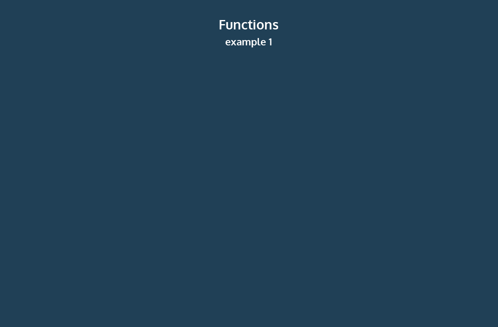

This is the start of the lessons on Functions

link to lessons:

https://www.codecademy.com/paths/build-web-apps-with-react/tracks/bwa-javascript-functions-arrays-and-loops/modules/learn-javascript-functions/lessons/functions/exercises/intro-to-functions

When first learning how to calculate the area of a rectangle, there’s a sequence of steps to calculate the correct answer:

1. Measure the width of the rectangle.
2. Measure the height of the rectangle.
3. Multiply the width and height of the rectangle.

With practice, you can calculate the area of the rectangle without being instructed with these three steps every time.

We can calculate the area of one rectangle with the following code:
```
const width = 10;
const height = 6;
const area =  width * height;
console.log(area); // Output: 60
```
Imagine being asked to calculate the area of three different rectangles:
```
// Area of the first rectangle
const width1 = 10;
const height1 = 6;
const area1 =  width1 * height1;

// Area of the second rectangle
const width2 = 4;
const height2 = 9;
const area2 =  width2 * height2;

// Area of the third rectangle
const width3 = 10;
const height3 = 10;
const area3 =  width3 * height3;
```
In programming, we often use code to perform a specific task multiple times. Instead of rewriting the same code, we can group a block of code together and associate it with one task, then we can reuse that block of code whenever we need to perform the task again. We achieve this by creating a function. A function is a reusable block of code that groups together a sequence of statements to perform a specific task.

In this lesson, you will learn how to create and use functions, and how they can be used to create clearer and more concise code.


### Instructions

Take a look at the provided GIF. It shows a function, named addOneSide, adding an additional side to different shape inputs. Notice how there is only one function, represented by the box, that is used to transform individual shapes (inputs) into new shapes (outputs).


